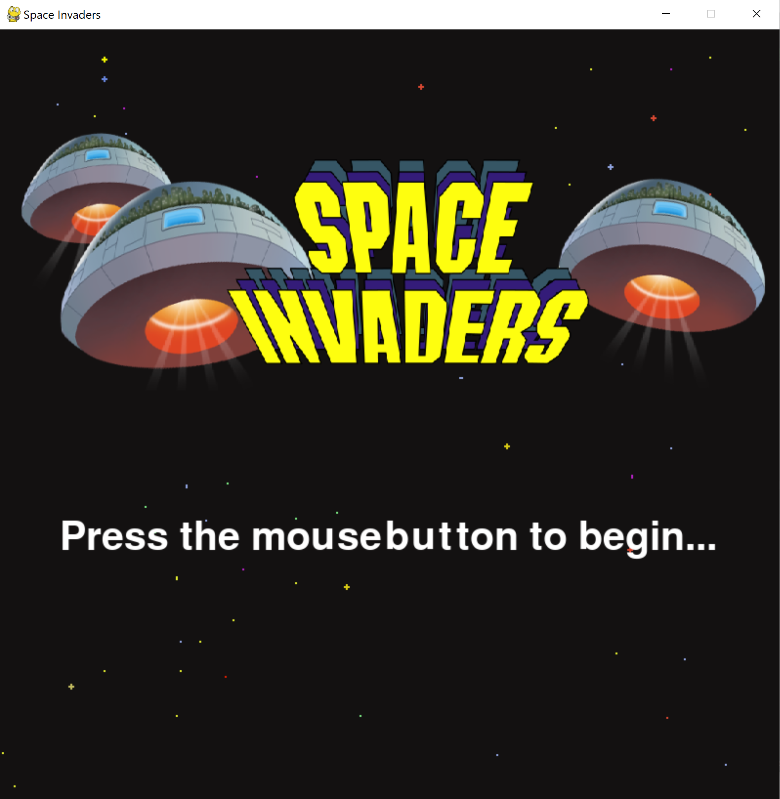
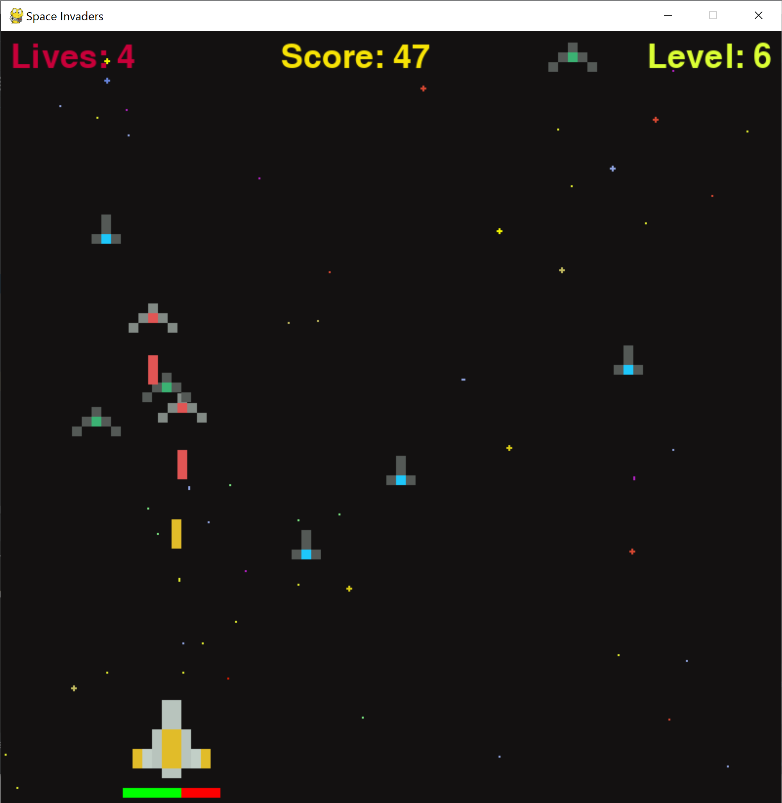

# First Python Project - Space Invaders

## Photos of the game:

## Notes:
I decided that I wanted to try learning python, so for my first introduction to the language, I took on a day-long project of trying create a simple variation of Space Invaders using pygame. Feel free to download the game to play or change the game code to create your own variation.

